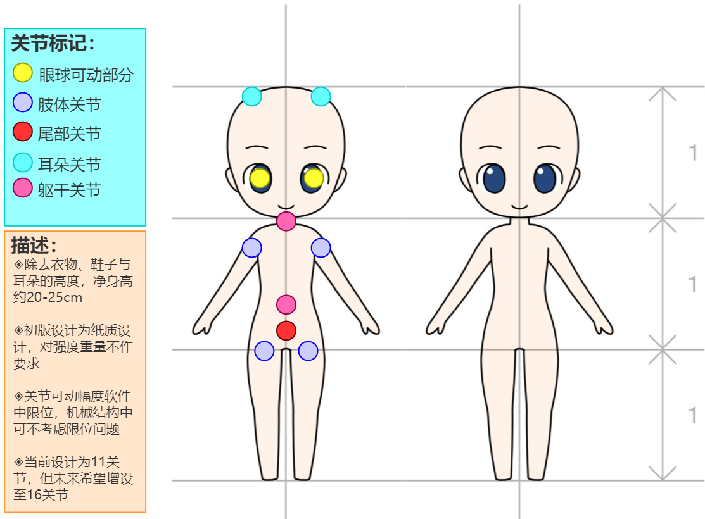

# PPCF-PaperPuppetControlFramework
Universal control framework about paper puppets. In addition, you can set the speed of a move. The frame can drive up to eight servos for movement. Servos can be used to drive joints, as well as eye and ear movements. In the future, a 16-servo version will be developed to achieve richer actions

### Hardware
|mcu|servo|power|connect|
|----|----|----|----|
|ESP8266(NodeMcu)/Atmega328P|MG90S/Motor 19500KV|MP1584|2.4Gwifi/BLE4.0|

### Code on mcu

```c++

Error：Exception (3):
  epc1=0x4000bf64 epc2=0x00000000 epc3=0x4000473f excvaddr=0x4023d571 depc=0x00000000

  >>>stack>>>

  void handleRoot() {
  String s = MAIN_page; //Read HTML contents
  server.send(200, "text/html", s); //Send web page
  }
  fix.`
```
Change the password to your own wifiSSID and PSWD, open the phone to connect to the 8268 AP, get the corresponding IP on serial to access the control page
The control page can control the operation of eight servos at the same time, and can record and store actions to adjust the movement speed of the servo

### Structure
Up to 8 servos moving asynchronously (because it uses interrupts)，we can only turn up to 8 joints. The test version fixes the position of the servo to test the feasibility

<div align="center"> </div>

### App

Working on it  :)

### Library

[VarSpeedServo](https://github.com/netlabtoolkit/VarSpeedServo)


